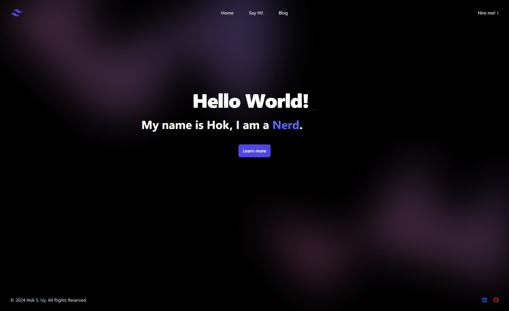

# Node.js React app for my Portfolio

## Description
This is meant to be a Docker containerized Node.js React app for hosting my portfolio on a VPS or other cloud based service. Currently this is hosted on a Hetzner VPS here: https://hsengu.com

## Built with
- Node.js
- React.js
- HTML
- CSS
- Tailwind CSS

## Deployed application relies and is deployed in conjunction with
- Nginx
- Docker
- Ghost blog
- Hetzner

## Screenshots

# Contributors
- Hok S. Uy