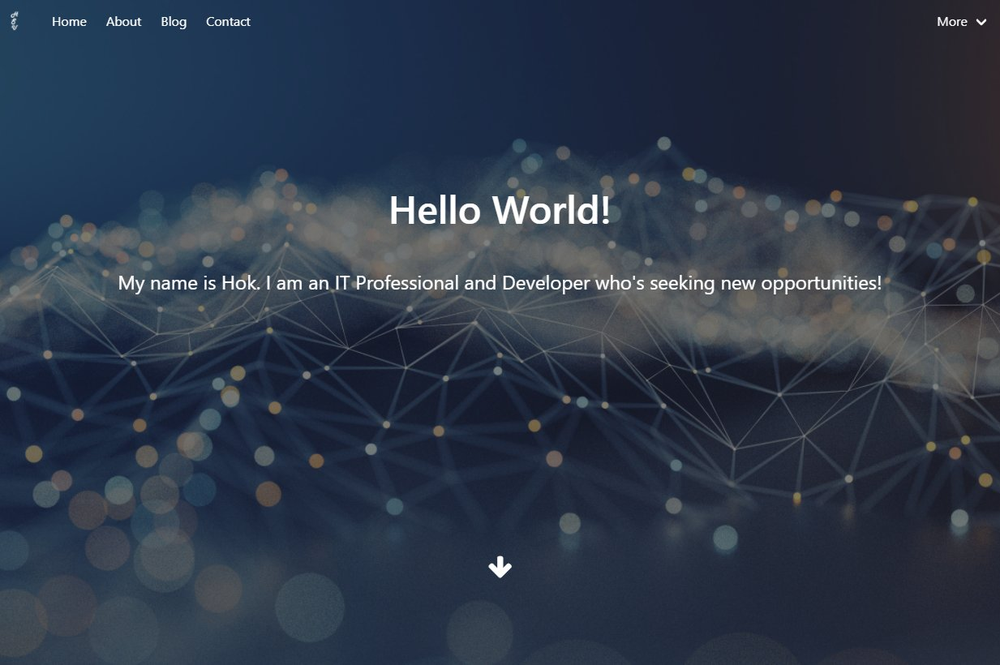

# Node.js Webapp for my Portfolio

## Description
This is meant to be a Docker containerized Node.js app for hosting my portfolio on a VPS or other cloud based service. Currently this is hosted on AWS Lightsail here: https://hsengu.com

## Built with
- Node.js
- Express.js
- Pug
- HTML
- CSS
- Bulma CSS Framework

## Deployed application relies and is deployed in conjunction with
- Nginx
- Docker
- Ghost blog
- AWS Lightsail

## Screenshots

# Contributors
- Hok S. Uy
